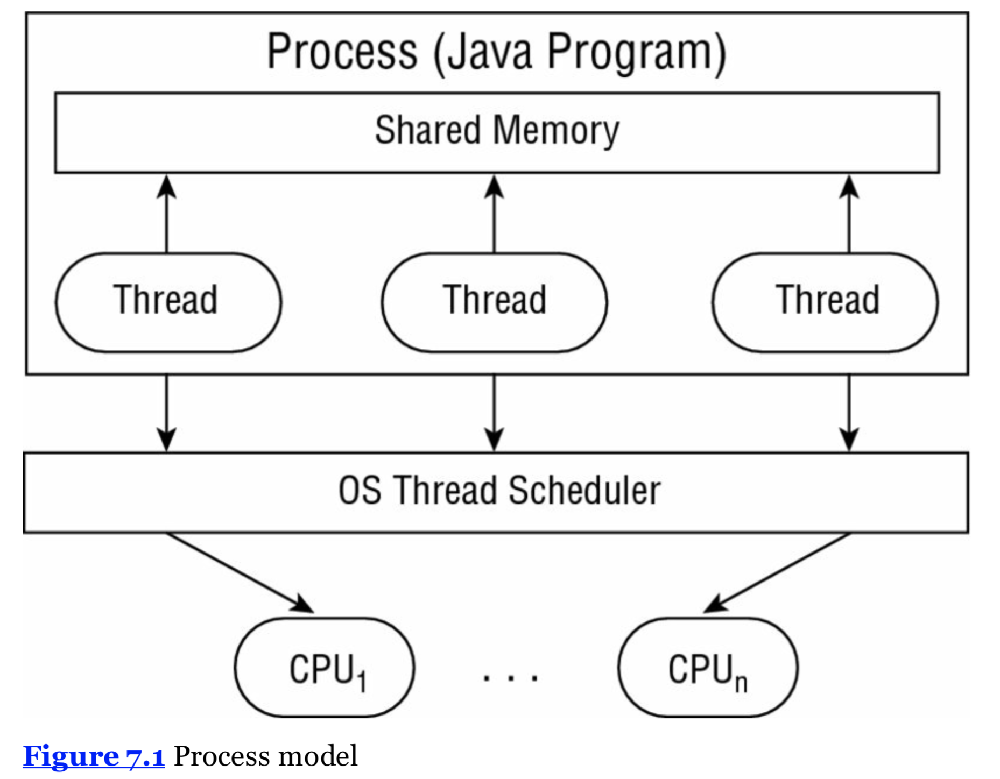
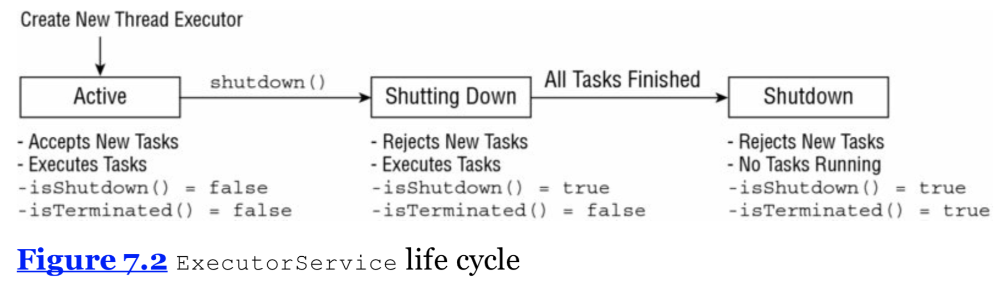
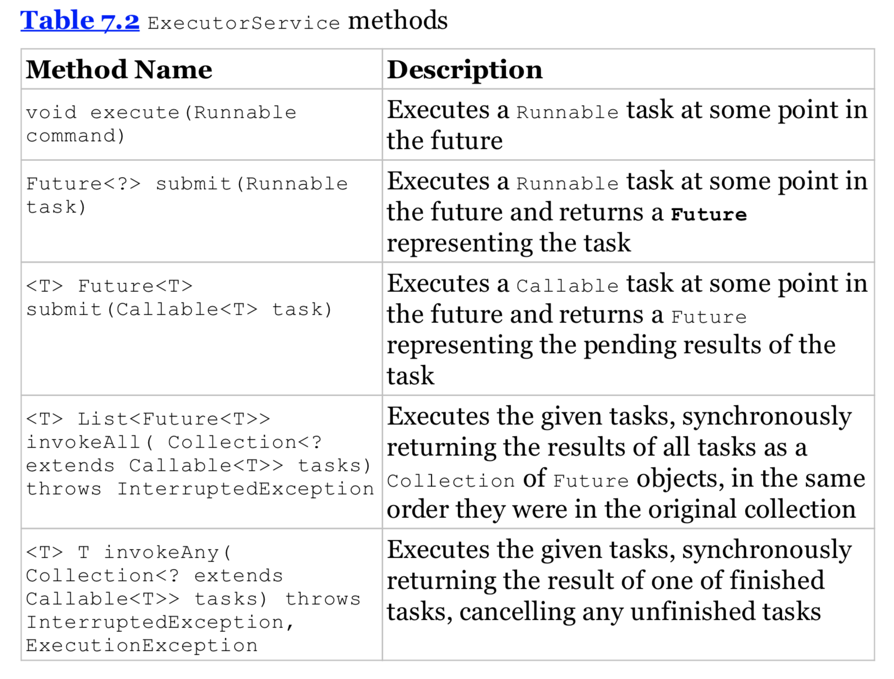
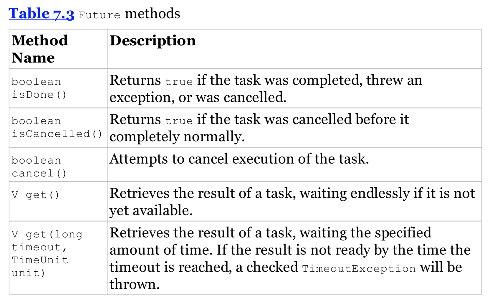

# 基础概念

## 什么是线程（thread）
线程是可以被操作系统调度的**最小**的执行单元。

## 什么是进程（process）
进程是一组同时执行的相关联的线程，并且有 shared environment。
也就是说在同一个进程内的线程们可以共享内存地址以及直接与各个线程直接交流。

## 什么是任务（task）
一个 task 是由一个线程完成的工作。（a single unit of work）
一个线程可以完成许多独立的 task，但是 only one task at a time。

## 线程的类型
系统线程（system thread） 由 JVM 创造并且在后台运行，一个很常见的例子就是 gc 线程。

用户线程（user-defined thread）是由程序开发者创造的，用来完成一个特殊的任务。

## 什么是 Concurrency
在同一时间执行多线程以及多进程的能力就被称为 concurrency。
The property of executing multiple threads and processes at the same time is referred to as concurrency.

## thread scheduler
一般而言线程数目是远远高于 cpu 处理器数目的，那么系统该怎么决定什么时候执行哪一个线程呢？这时候我们就需要 thread scheduler 来决定现在可以被 cpu “临幸”的线程。

## 上下文切换（context switch）
线程被分配使用 cpu 的时间是有限的，那么当一个线程时间用完，然而它的处理还没有完成时，这样的情景就被称为上下文切换（context switch）。系统需要保存这个线程的状态，为了以后能够恢复再度执行。需要记住的就是这个保存和再读的操作一定会有时间和资源开销。

## 线程优先级（thread priority）
一个线程可以打断另一个线程的执行，如果当前执行的线程优先级没有这个线程高的话。在 Java 中，优先级由 integer 来表示。

## Java 中的两种方法

    @FunctionalInterface public interface Runnable {
      void run();
    }

    public class PrintData implements Runnable {
      public void run() {
        for (int i = 0; i < 3; ++i)
          System.out.println("Printing record: " + i);
      }

      public static void main(String []args) {
        (new Thread(new PrintData())).start();
      }
    }

    public class ReadInventoryThread extends Thread {
      public void run() {
        System.out.println("Printing zoo inventory");
      }

      public static void main(String[] args) {
        (new ReadInventoryThread()).start();
      }
    }

以下的代码会输出什么呢？

    public static void main(String[] args) {
      System.out.println("begin");
      (new ReadInventoryThread()).start();
      (new Thread(new PrintDate())).start();
      (new ReadInventoryThread()).start();
      System.out.println("end");
    }

答案是这是不确定的，一种可能的情况是：

    begin
    Printing zoo inventory
    Printing record: 0
    end
    Printing zoo inventory
    Printing record: 1
    Printing record: 2

这个例子使用了 4 个线程， main() user thread 以及其他三个（由 main 创造）。关键在于线程的执行顺序是不确定的。

## Thread and Runnable

> * 如果你需要定义你自己的 Thread rules，比如 priority Thread，继承 Thread 更合适。
> * Java 本身不支持多继承，所以 implementing Runnable 更灵活。
> * Implementing Runnable 更面向对象，因为这样做分离了要做的 task 以及执行这个 task 的 Thread 对象。
> * Implementing Runnable 便于 Concurrency API 来使用。

## Polling with Sleep

poll 的意思在字典里是 process of voting in an election，也就是说在选举时候的投票过程。在这里 polling 的意思是在固定的时间区间内不时地去查看数据的过程。举个简单的例子，现在你有一个线程来修改一个 shared static counter 变量，并且你的 main() thread 正在等待这个值增加到100。

    public class CheckResults {
      private static int counter = 0;
      public static void main(String[] args) {
        new Thread(() -> {
          for (int i = 0; i < 500; ++i)
            CheckResults.counter++;
        }).start();
        while (checkResults.counter < 100)
          System.out.println("Not reached yet");

        System.out.println("Reached!");
      }
    }

这个 while() 循环以及 “Not reached yet” 会输出多少次呢？正确的答案是我们不知道！可以是0次，10次，甚至100万次。为什么会这样呢？回想我们前面提到的 **thread scheduler**，如果我们的 scheduler 很差，这段程序可能永远不会结束！

我们可以使用 Thread.sleep() 来实现 polling。这个方法可以使正在执行的线程休息一段时间。

    public class CheckResults {
      private static int counter = 0;
      public static void main(String[] args) throws InterruptedException {
        new Thread(() -> {
          for (int i = 0; i < 500; ++i)
            CheckResults.counter++;
        }).start();

        while (CheckResults.counter < 100) {
          System.out.println("Not reached yet");
          Thread.sleep(1000); // 1 second
        }

        System.out.println("Reached!");
      }
    }

Polling 可以防止 CPU 被无限循环所淹没，但它不保证这个循环什么时候会结束。

## Single-Thread Executor

Java 提供 ExecutorService ，例子如下：

    import java.util.concurrent.ExecutorService;
    import java.util.concurrent.Executors;
    public class ZooInfo {
    public static void main(String[] args) {
        ExecutorService service = null;
        try {
            service = Executors.newSingleThreadExecutor();

            System.out.println("begin");
            service.execute(() -> System.out.println("Printing zoo inventory1"));
            service.execute(() -> {
                for (int i = 0; i < 3; ++i)
                    System.out.println("Printing record: " + i);
            });
            service.execute(() -> System.out.println("Printing zoo inventory2"));
            System.out.println("end");
        } finally {
            if (service != null) service.shutdown();
        }
    }
}

    begin
    Printing zoo inventory1
    Printing record: 0
    Printing record: 1
    end
    Printing record: 2
    Printing zoo inventory2

对于 single-thread executor 来说，可以保证结果的顺序是进入 executor service 的顺序。注意这里“end”已经输出了而我们的 thread executor tasks 还在执行。这是因为 main() 是一个独立的线程相比�于 ExecutorService，main() 线程也可以在其他线程运行的时候执行任务。

## Shutting Down a Thread Executor

记得要使用 shutdown() 方法在你完成了任务以后，为什么呢？ thread executor 在第一个 task 执行的时候会创建一个 non-daemon thread，所以如果你没有使用 shutdown 方法的话你的应用将永远不结束。

shutdown 的过程如下：

> * 首先拒绝任何新的提交到 thread executor 的 task，此时调用 isShutdown() 会返回 true，isTerminated() 会返回 false。如果有新的 task 提交， 会抛出 RejectedExecutionException。
> * 当所有 active tasks 都完成以后，isShutdown() 以及 isTerminated() 都会返回 true。

## Submitting Tasks

有许多种方式可以提交 task 给 ExecutorService instance，之前我们见到的就是 execute()方法。这个方法返回的类型是 void，也就是说这是一个 “fire-and-forget” 方法，执行结果并不能直接被 calling thread 得到。具体的方法见下图：

## Waiting for Results

我们如何知道提交给 ExecutorService 的 task 已经完成了呢？前图的 submit() 方法会返回 Future object，

    Future<?> future = service.submit(() -> System.out.println("Hello Zoo"));

    import java.util.concurrent.*;

    public class CheckResults {
      private static int counter = 0;
      public static void main(String[] args) throws       InterruptedException, ExecutionException{
        ExecutorService service = null;
        try {
            service = Executors.newSingleThreadExecutor();
            Future<?> result = service.submit(() -> {
                for (int i = 0; i < 500; ++i)
                    CheckResults.counter++;
            });
            result.get(10, TimeUnit.SECONDS);
            System.out.println("Reached!");
        } catch (TimeoutException e) {
            System.out.println("Not reached in time");
        } finally {
            if (service != null) service.shutdown();
        }
    }
    }

## Introducing Callable

    @FunctionalInterface public interface Callable<V> {
      V call() throws Exception;
    }

    import java.util.concurrent.*;

    public class AddData {
      public static void main(String[] args) throws InterruptedException, ExecutionException {
        ExecutorService service = null;
        try {
          service = Executors.newSingleThreadExecutor();
          Future<Integer> result = service.submit(() -> 30+11);
          System.out.println(result.get());
        } finally {
          if (service != null) service.shutdown();
        }
      }
    }

## Waiting for All Tasks to Finish

    ExecutorService service = null;
    try {
      service = Executors.newSingleThreadExecutor();
      // Add tasks to the thread executor
      ...
    } finally {
      if (service != null) service.shutdown();
    }
    if (service != null) {
      service.awaitTermination(1, TimeUnit.MINUTES);
      // Check whether all tasks are finished
      if (service.isTerminated())
        System.out.println("All tasks finished");
      else
        System.out.println("At least one task is still running");
    }

## Scheduling Tasks

有时候我们需要 schedule 一些 task，比如定时地执行某个任务。 ScheduledExecutorService 继承自 ExecutorService。

    ScheduledExecutorService service = Executors.newSingleThreadScheduledExecutor();

