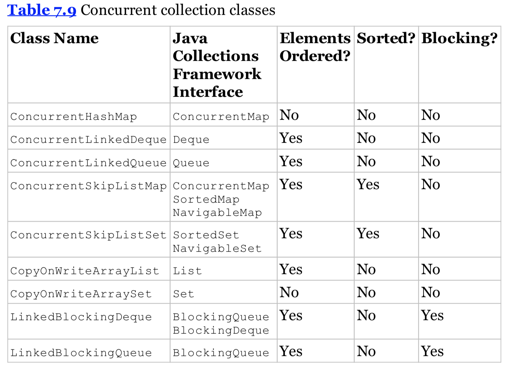

## Introducing Concurrent Collections

先看一个例子：

```java
public class ZooManager {
  private Map<String, Object> foodData = new HashMap();

  public synchronized void put(String key, String value) {
    foodData.put(key, value);
  }

  public synchronized Object get(String key) {
    return foodData.get(key);
  }
}
```

Java 作者考虑的很周到，怕我们自己会忘记添加 synchronized 关键字，所以可以使用 concurrent collections，如下：

```java
public class ZooManager {
  private Map<String, Object> foodData = new ConcurrentHashMap();

  public void put(String key, String value) {
    foodData.put(key, value);
  }

  public Object get(String key) {
    return foodData.get(key);
  }
}
```

## Understanding Memory Consistency Errors

什么是 memory consistency error ？这指的是两个线程看到的数据不一致，*two threads have inconsistent views of what should be the same data.* 当两个线程要修改同一个 non-concurrent collection 的时候，JVM 有可能在运行时会抛出 ConcurrentModificationException。事实上单线程也可能出问题，如下：

```java
Map<String, Object> foodData = new HashMap();
foodData.put("penguin", 1);
foodData.put("flamingo", 2);
for (String key : foodData.keySet())
  foodData.remove(key);
```

这段代码可能抛出 ConcurrentModificationException，因为 iterator keyset() 没有更新，当第一个元素被移除的时候。使用 ConcurrentHashMap 就能避免这个问题。

## Working with Concurrent Classes



## Understanding CopyOnWrite Collections

```java
List<Integer> list = new CopyOnWriteArrayList<>(Arrays.asList(4,3,52));
for (Integer item : list) {
  System.out.print(item + " ");
  list.add(9);
}
System.out.println();
System.out.println("Size: " + list.size());
```

以上代码的输出如下：

    4 3 52
    Size: 6

CopyOnWrite class 会使用很多内存，因为每次修改 collection 都会新建一个新的 collection，所以适合于读操作远多于写操作的场景。

# Working with Parallel Streams

之前学的 Streams API 都是关于函数式编程的，另一大特色就是 Streams API 有 built-in concurrency support。

### serial stream

serial stream 指的是结果都有序的 stream，only one entry being processed at a time。

### parallel stream

parallel stream 指的是能够使用多线程同时处理的 stream。比如你可以使用一个 parallel stream 以及 map() 方法来同时处理 stream 中的元素，大幅提升效率。

## Creating Parallel Streams

第一种创建 parallel stream 的方法：from an existing stream。直接对现有的 stream 调用 parallel()方法，如下：

    Stream<Integer> stream = Arrays.asList(1,2,3,4,5,6).stream();
    Stream<Integer> parallelStream = stream.parallel();

第二种创建 parallel stream 的方法：from a Java collection class，如下：

    Stream<Integer> parallelStream2 = Arrays.asList(1,2,3,4,5,6).parallelStrean();

## Processing Tasks in Parallel

创建 parallel stream 很简单，难的在于如何使用它，来看一个例子：

    Arrays.asList(1,2,3,4,5,6)
          .stream()
          .forEach(s -> System.out.print(s+" "));

输出如下：

    1 2 3 4 5 6

因为我们在使用的是一个 serial stream。

如果我们使用 parallel stream：

    Arrays.asList(1,2,3,4,5,6)
          .parallelStream()
          .forEach(s -> System.out.print(s+" "));

由于使用的是 parallel stream，一些可能的结果如下：

    4 1 6 5 2 3
    5 2 1 3 6 4
    1 2 6 4 5 3

## Understanding Performance Improvements

接下来我们看一个实际的应用来展示 parallel stream 的威力。现在我们的任务需要我们处理 4000 条记录，每条大约需要 10 毫秒。具体如下：

```java
import java.util.ArrayList;
import java.util.List;

public class WhaleDataCalculator {
    public int processRecord(int input) {
        try {
            Thread.sleep(10);
        } catch (InterruptedException e) {
            // handle ...
        }
        return input + 1;
    }

    public void processAllData(List<Integer> data) {
        data.stream().map(a -> processRecord(a)).count();
    }

    public static void main(String []args) {
        WhaleDataCalculator calculator = new WhaleDataCalculator();

        // define data
        List<Integer> data = new ArrayList<>();
        for (int i = 0; i < 4000; ++i) data.add(i);

        // process data
        long start = System.currentTimeMillis();
        calculator.processAllData(data);
        double time = (System.currentTimeMillis() - start) / 1000.0;

        // report results
        System.out.println("\nTasks completed in: " + time + " seconds");
    }
}
```

    Tasks completed in: 46.192 seconds

如果我们使用 parallel stream，那么处理就可以并发进行：

    public void processAllData(List<Integer> data) {
      data.parallelStream().map(a -> processRecord(a)).count();
    }

结果如下图：

    Tasks completed in: 11.635 seconds

具体的时间和你电脑的 CPU 数目有关。

## Understanding Independent Operations

为什么 parallel stream 能提高性能呢？关键点在于运算彼此都是独立的，某一个运算的结果并不会需要或者影响另一个运算的结果，就比如上例中的 processRecord()。再来看一个例子：

    Arrays.asList("jackal", kangaroo","lemur")
          .parallelStream()
          .map(s -> s.toUpperCase())
          .forEach(System.out::println);

在这个例子中把 “jackal” 转换成 “JACKAL” 和把 “kangaroo” 转换成 ”KANGAROO“ 是彼此独立的，所以也适合用 parallel stream。

# Processing Parallel Reductions

## Performing Order-Based Tasks

parallel stream 并不保证元素顺序，例如：

    System.out.print(Arrays.asList(1,2,3,4,5,6).stream().findAny().get

由于是 serial stream，所以结果总是一致的，输出 1。如果是 parallel stream，JVM 会创建一些线程来处理 stream，当你调用 findAny() 的时候 JVM 会选择第一个线程来处理并返回结果，结果就是输出可能是 1，可能是 4，也可能是其他的，总而言之结果是 unpredictable。

## Combining Results with reduce()

reduce() combines a stream into a single Object。该方法的第一个 parameter 是 identity，第二个 parameter 是 accumulator，第三个是 combiner。

    System.out.println(Arrays.asList('w','o','l','f')
          .stream()
          .reduce("", (c, s1) -> c + s1,
                 (s2, s3) -> s2 + s3));

## Requirements for reduce() Arguments

> * The Identity must be defined such that for all elements in the stream u, combiner.apply(identity, u) is equal to u.
> * The accumulator operator op must be associative and stateless such that (a op b) op c is equal to a op (b op c).
> * The combiner operator must also be associative and stateless and compatiable with the identity, such that for all u and t combiner.apply(u, accumulator.apply(identity,t)) is equal to accumulator.apply(u, t).

来看一些例子：

    System.out.println(Arrays.asList(1,2,3,4,5,6)
          .parallelStream()
          .reduce(0, (a, b) -> (a-b))); // not an associative accumulator

结果可能是 -21，3 或者其他的值。再看另一个例子：

    System.out.println(Arrays.asList("w","o","l","f")
          .parallelStream()
          .reduce("X", String:: concat));

一个可能的输出结果是 XwXoXlXf，违反了第一条原则，结果是无法预测的。

# Managing Concurrent Processes

## Creating a CyclicBarrier

现在我们的任务是打扫狮子的笼子，我们有四个工人来完成这个工作，这里的限制是我们希望狮子不在笼子里的时候去打扫，并且打扫的时候狮子不能进来。具体代码如下：

```java
import java.util.concurrent.ExecutorService;
import java.util.concurrent.Executors;

public class LionPenManager {

    private void removeAnimals() {
        System.out.println("Removing animals");
    }

    private void cleanPen() {
        System.out.println("Cleaning the pen");
    }

    private void addAnimals() {
        System.out.println("Adding animals");
    }

    public void performTask() {
        removeAnimals();
        cleanPen();
        addAnimals();
    }

    public static void main(String[] args) {
        ExecutorService service = null;
        try {
            service = Executors.newFixedThreadPool(4);
            LionPenManager manager = new LionPenManager();
            for (int i = 0; i < 4; ++i) {
                service.submit(() -> manager.performTask());
            }
        } finally {
            if (service != null) service.shutdown();
        }
    }
}
```

输出结果如下：

    Removing animals
    Removing animals
    Removing animals
    Cleaning the pen
    Cleaning the pen
    Adding animals
    Adding animals
    Cleaning the pen
    Removing animals
    Cleaning the pen
    Adding animals
    Adding animals

更好的实现方式是使用 CyclicBarrier，如下：

```java
import java.util.concurrent.BrokenBarrierException;
import java.util.concurrent.CyclicBarrier;
import java.util.concurrent.ExecutorService;
import java.util.concurrent.Executors;

public class LionPenManager {

    private void removeAnimals() {
        System.out.println("Removing animals");
    }

    private void cleanPen() {
        System.out.println("Cleaning the pen");
    }

    private void addAnimals() {
        System.out.println("Adding animals");
    }

    public void performTask(CyclicBarrier c1, CyclicBarrier c2) {
        try {
            removeAnimals();
            c1.await();
            cleanPen();
            c2.await();
            addAnimals();
        } catch (InterruptedException | BrokenBarrierException e) {
            // handle ....
        }
    }

    public static void main(String[] args) {
        ExecutorService service = null;
        try {
            service = Executors.newFixedThreadPool(4);
            LionPenManager manager = new LionPenManager();
            CyclicBarrier c1 = new CyclicBarrier(4);
            CyclicBarrier c2 = new CyclicBarrier(4, () -> System.out.println("*** Pen Cleaned!"));
            for (int i = 0; i < 4; ++i) {
                service.submit(() -> manager.performTask(c1, c2));
            }
        } finally {
            if (service != null) service.shutdown();
        }
    }
}
```

结果如下，这次结果就是我们想要的了。CyclicBarrier 类允许我们执行复杂的多线程任务，所有线程会停止并且等待 logical barriers。

    Removing animals
    Removing animals
    Removing animals
    Removing animals
    Cleaning the pen
    Cleaning the pen
    Cleaning the pen
    Cleaning the pen
    *** Pen Cleaned!
    Adding animals
    Adding animals
    Adding animals
    Adding animals

## Applying the Fork/Join Framework

现在我们需要给动物园的动物称重，假设有10个动物，

    Double[] weights = new Double[10];

更进一步，一个人最多一个小时可以量3个动物，现在我们需要在一个小时内完成整个任务。假设我们从一个工人开始，首先他会意识到他自己不可能按时完成任务，好在他懂得递归，他将10个动物分成两部分，每部分5个，然后自己负责一部分，另一部分请另一个工人来帮忙。之后重复这个步骤直到每个工人只用负责最多3个（base case）。fork/join framework 需要如下步骤：

> * Create a ForkJoinTask.
> * Create the ForkJoinPool.
> * Start the ForkJoinTask.

第一步最为复杂，因为它定义了 recursive process。这里有两个类，RecursiveAction 和 RecursiveTask，都实现了 ForkJoinTask 接口。

第一个类，RecursiveAction 是一个抽象类并且需要我们实现 compute() 方法，下面来看一个具体的例子：

```java
import java.util.Random;
import java.util.concurrent.RecursiveAction;

public class WeighAnimalAction extends RecursiveAction{
    private int start;
    private int end;
    private Double[] weights;

    public WeighAnimalAction(Double[] weights, int start, int end) {
        this.start = start;
        this.end = end;
        this.weights = weights;
    }

    protected void compute() {
        if (end-start <= 3) {
            for (int i = start; i < end; ++i) {
                weights[i] = (double) new Random().nextInt(100);
                System.out.println("Animal Weighed : " + i);
            }
        }
        else {
            int middle = start + ((end - start) / 2);
            System.out.println("[start=" + start + ",middle=" + middle + ",end=" + end + "]");
            invokeAll(new WeighAnimalAction(weights, start, middle),
                      new WeighAnimalAction(weights, middle, end));
        }
    }
}

    public static void main(String[] args) {
        Double[] weights = new Double[10];

        ForkJoinTask<?> task = new WeighAnimalAction(weights, 0, weights.length);
        ForkJoinPool pool = new ForkJoinPool();
        pool.invoke(task);

        // print results
        System.out.println();
        System.out.print("Weights: ");
        Arrays.asList(weights).stream().forEach(
                d -> System.out.print(d.intValue() + " ")
        );
    }
```

输出结果如下图：

    [start=0,middle=5,end=10]
    [start=0,middle=2,end=5]
    Animal Weighed : 0
    Animal Weighed : 1
    Animal Weighed : 2
    Animal Weighed : 3
    [start=5,middle=7,end=10]
    Animal Weighed : 4
    Animal Weighed : 5
    Animal Weighed : 7
    Animal Weighed : 8
    Animal Weighed : 9
    Animal Weighed : 6

    Weights: 85 14 23 24 50 3 58 90 11 33

默认设置下， ForkJoinPool 会根据处理器的数量来决定创建多少线程。这个例子的关键点在于理解如下，处理过程刚开始是以 a single task 开始，然后会 spawn additional concurrent task，然后来处理。

## Working with a RecursiveTask

再看下面这个例子：

```java
import java.util.Random;
import java.util.concurrent.RecursiveTask;

public class WeighAnimalTask extends RecursiveTask<Double> {
    private int start;
    private int end;
    private Double[] weights;

    public WeighAnimalTask(Double[] weights, int start, int end) {
        this.start = start;
        this.end = end;
        this.weights = weights;
    }

    protected Double compute() {
        if (end-start <= 3) {
            double sum = 0;
            for (int i = start; i < end; ++i) {
                weights[i] = (double) new Random().nextInt(100);
                System.out.println("Animal Weighed : " + i);
                sum += weights[i];
            }
            return sum;
        }
        else {
            int middle = start + ((end - start) / 2);
            System.out.println("[start=" + start + ",middle=" + middle + ",end=" + end + "]");
            RecursiveTask<Double> otherTask = new WeighAnimalTask(weights, start, middle);
            otherTask.fork();
            return new WeighAnimalTask(weights, middle, end).compute() + otherTask.join();
        }
    }
}

     public static void main(String[] args) {
        Double[] weights = new Double[10];
        ForkJoinTask<Double> task = new WeighAnimalTask(weights, 0, weights.length);
        ForkJoinPool pool = new ForkJoinPool();
        Double sum = pool.invoke(task);
        System.out.println("Sum : " + sum);
    }
```

fork() method instructs the fork/join framework to complete the task in a separate thread, while the join() method causes the current thread to wait for the resutls.

结果如下：

    [start=0,middle=5,end=10]
    [start=5,middle=7,end=10]
    Animal Weighed : 7
    Animal Weighed : 8
    Animal Weighed : 9
    Animal Weighed : 5
    Animal Weighed : 6
    [start=0,middle=2,end=5]
    Animal Weighed : 2
    Animal Weighed : 0
    Animal Weighed : 3
    Animal Weighed : 4
    Animal Weighed : 1
    Sum : 492.0

fork join 的顺序很重要，下面这个实现并不是 multi-threaded，而是single-threaded：

    RecursiveTask<Double> otherTask = new WeighAnimalTask(weights, start, middle);
    Double otherResult = otherTask.fork().join();
    return new WeighAnimalTask(weights,middle,end).compute() + otherResult;

在这段代码中，the current thread 调用 join(),让它等待[start, middle] 子任务完成，之后才开始[middle, end] 任务。

## Identifying Fork/Join Issues

Tips for Fork/Join：

> * The class should extend RecursiveAction or RecursiveTask.
> * If the class extends RecursiveAction, then it should override a protected compute() method that takes no arguments and returns void.
> * If the class extends RecursiveTask, then it should override a protected compute() method that takes no arguments and returns a generic type listed in the class definition.
> * The invokeAll() method takes two instances of the fork/join class and does not return a result.
> * The fork() method causes a new task to be submitted to the pool and is similar to the thread executor submit() method.
> * The join() method is called after the fork() method and causes the current thread to wait for the results of a subtask.
> * Unlike fork(), calling compute() within a compute() method causes the task to wait for the results of the subtask.
> * The fork() method should be called before the current thread performs a compute() operation, with join() called to read the results afterward.
> * Since compute() tasks no arguments, the constructor of the class is often used to pass instructions to the task.
