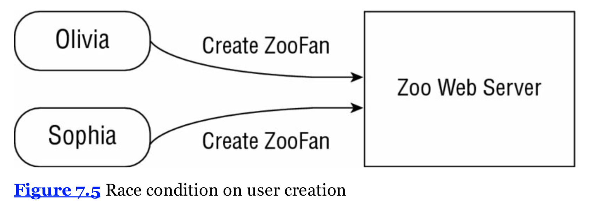

# Identifying Threading Problems

## Understanding Liveness

Liveness is the ability of an application to be able to execute in a timely manner. Typically there are three types of liveness issues:

## 死锁(deadlock)

当两个或以上线程永久被阻塞，在等待彼此的时候死锁就发生了。(Deadlock occurs when two or more threads are blocked forever, each waiting on the other) 一个实际的例子如下，我们的动物园有两只狐狸，Foxy 和 Tails。Foxy 喜欢先吃饭然后再喝水，Tails 喜欢先喝水再吃饭。他们彼此都不愿意分享，所以只有食物和水被一人独占的时候他们才会享用。动物管理员把食物和水放在了相对的两边，现在假设我们聪明的狐狸需要花 100 毫秒从一边赶到另一边，那么如果 Foxy 先拿到了食物 Tails 先拿到了水会发生什么呢？具体看下面的代码：

```java
import java.util.concurrent.ExecutorService;
import java.util.concurrent.Executors;

class Food {}
class Water {}

public class Fox {

    public void eatAndDrink(Food food, Water water) {
        synchronized (food) {
            System.out.println("Got Food!");
            move();
            synchronized (water) {
                System.out.println("Got Water!");
            }
        }
    }

    public void drinkAndEat(Food food, Water water) {
        synchronized (water) {
            System.out.println("Got Water!");
            move();
            synchronized (food) {
                System.out.println("Got Food!");
            }
        }
    }

    public void move() {
        try {
            Thread.sleep(100);
        } catch (InterruptedException e) {
            // handle ...
        }
    }

    public static void main(String []args) {
        Fox foxy = new Fox(); // food, water
        Fox tails = new Fox();// water, food
        Food food = new Food();
        Water water = new Water();

        // process data
        ExecutorService service = null;
        try {
            service = Executors.newScheduledThreadPool(10);
            service.submit(() -> foxy.eatAndDrink(food, water));
            service.submit(() -> tails.drinkAndEat(food, water));
        } finally {
            if (service != null) service.shutdown();
        }
    }
}
```

输出如下：

    Got Food！
    Got Water！

在这个例子里，Foxy 取得了食物然后移动到另一边去取水，然后这时候水已经被 Tails 独占了，Tails 喝了水在等待食物，结果就是彼此都在等待资源，然后资源永远不会 available。

## Starvation

当一个线程无休止地被拒绝 access 共享资源和锁时，饥饿就发生了。(Starvation occurs when a single thread is perpetually denied access to a shared resource or lock.)该线程仍然处于 active，但由于别的线程总是在占有资源所以它无法完成任务。

继续我们的动物园的例子，假设我们现在有一群非常非常饿并且非常凶残的狐狸，每当 Foxy 站起来想去获得食物的时候总有一只狐狸去把 Foxy 推开并且抢走她的食物，Foxy 仍然可以做其他的事情但是她不可能获得食物了。（她可以睡觉，散步。。。）

## Livelock

当两个或以上线程在概念上被永久阻塞，尽管它们仍然 active 并且想要完成自己的任务的时候，活锁发生了。(Livelock occurs when two or more threads are conceptually blocked forever, although they are each still active and trying to complete their task.) Livelock 是 resource starvation 的一个特殊情况，两个或以上的线程尝试取得一系列的锁 (actively try to acquire a set of locks)，但是取不到，并且重启部分过程。

Livelock 一般是两个线程想要解决 deadlock 所发生的。回到我们的例子，假设现在 Foxy 和 Tails 彼此握有各自的食物和水，她们都意识到了在这样的状态下无法完成 meal，于是她们有意识的放弃了占有的食物和水，去获取另一种资源。(Foxy  去取水，Tails 去取食物) 现在 Foxy 有了水，Tails 有了食物，但她们更加不可能完成 meal 了！

如果 Foxy 和 Tails 永远重复以上的步骤，那么这就是 Livelock。其实这是 deadlock recovery 典型的一种失败案例，彼此都意识到进入了死锁想要通过释放资源来解决，不幸的是这样根本无法解决。

## Managing Race Conditions

Race Condition 是当两个应该顺序执行的任务在同一时间完成了并造成了我们不想要的结果。(an undesirable result that occurs when two tasks, which should be completed sequentially, are completed at the same time)

我们来举一个例子，假设现在我们有两个动物园赞助人，Olivia 和 Sophia。她们正在注册动物园网站账号，碰巧的是她们都想使用 ZooFan 这个用户名，同时发出了这个请求，如下图：



那么我们的服务器应该如何响应呢？

## Possible Outcomes for This Race Condition

> * 两个用户都创建 ZooFan 成功。
> * 两个用户都失败，服务器返回 error 信息。
> * 一个用户成功，另一个收到返回的 error 信息。
